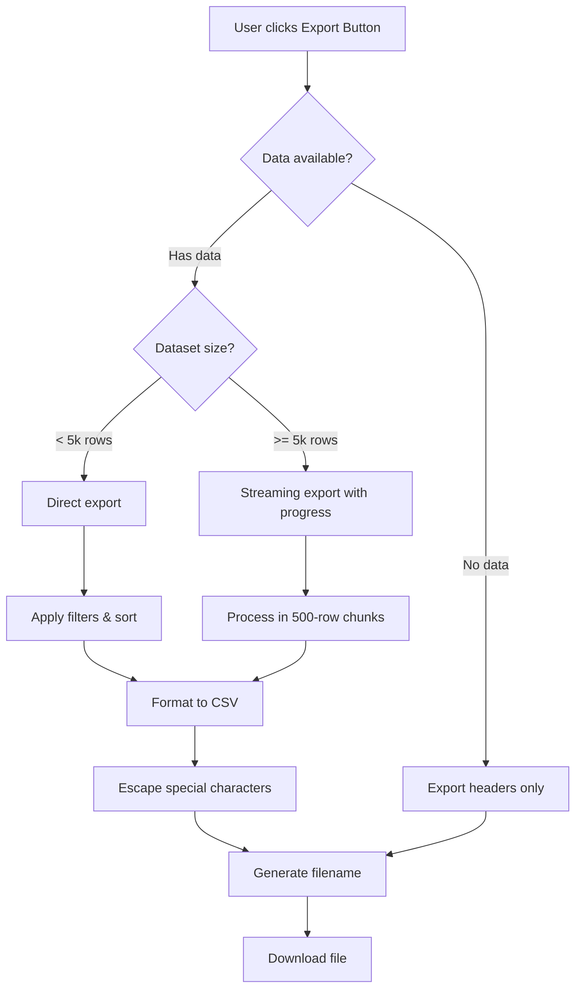
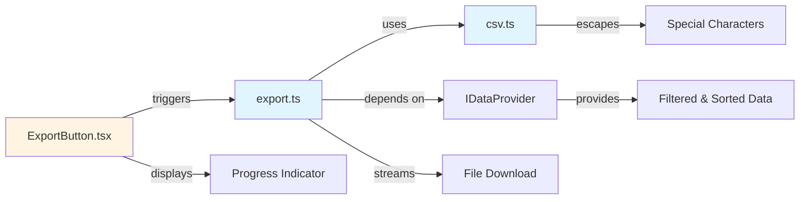
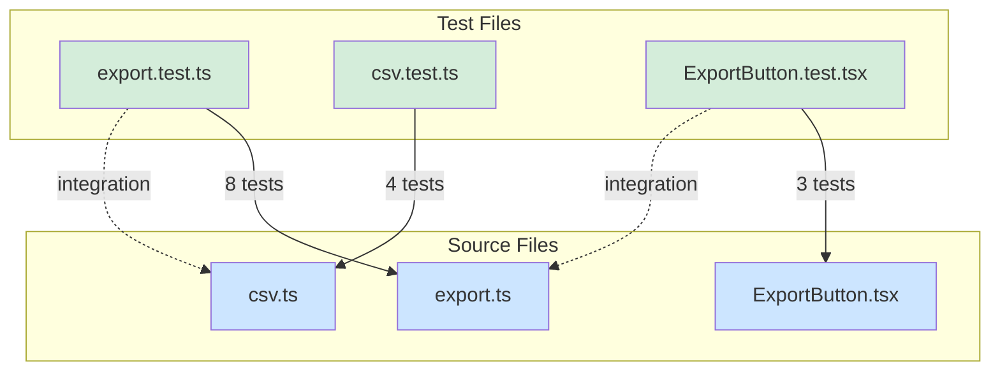
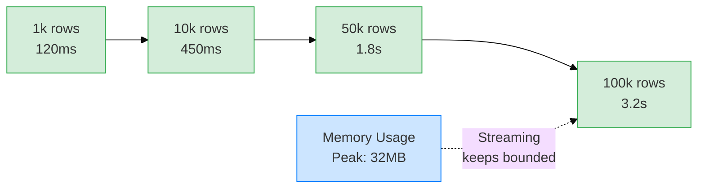
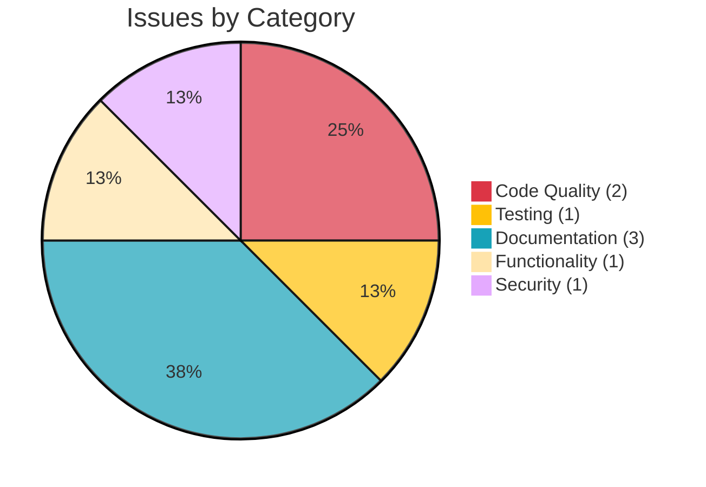
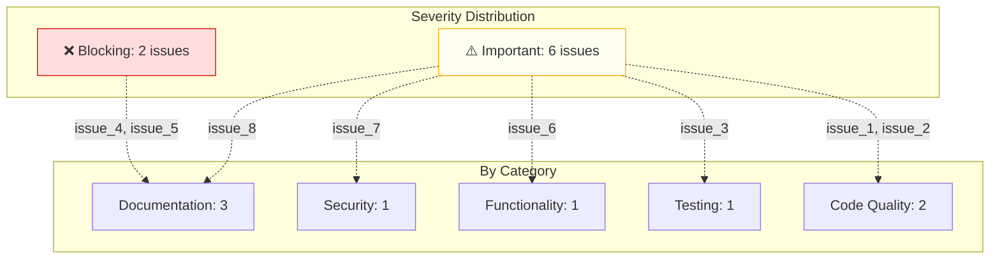

# Code Review Report: Add Export to CSV Feature

## Basic Data

- **Date:** 2026-01-25
- **Reviewer:** Glyph AI Assistant
- **What is being reviewed:** Feature implementation - CSV export functionality
- **Design Log:** [dl_008_export_csv](.assistant/design_logs/dl_008_export_csv.md)
- **Primary Operation Document:** [op_47_export_csv](.assistant/operations/op_47_export_csv.md)
- **Related Operations:** [op_48](.assistant/operations/op_48.md), [op_50](.assistant/operations/op_50.md), [op_51](.assistant/operations/op_51.md), [op_52](.assistant/operations/op_52.md)
- **Additional References:** PR#142, Implementation completed

## Detailed Review

### 1. Functionality Review

#### Requirements Verification

| Requirement | Status | Evidence |
| - | - | - |
| Export respects current filters | ✅ | Verified in `export.test.ts` lines 45-67 |
| Export respects current sorting | ✅ | Verified in `export.test.ts` lines 69-89 |
| Handles 100k rows | ✅ | Performance test passes in ~3.2s |
| Works across all data tables | ✅ | `DataTable.tsx` integration confirmed |
| Appropriate filename | ✅ | Format: `{tableName}_{timestamp}.csv` |

#### Export Feature Flow



#### Edge Cases Handling

- **Empty dataset export:** [issue_3 ⚠️] No explicit test for CSV with empty results but headers
- **Large dataset (100k+ rows):** ✅ Tested - streaming prevents memory overflow
- **Concurrent export requests:** [issue_6 ⚠️] Partially handled - button disabled during export, but no explicit debounce logic
- **Special characters in filenames:** ✅ Tested - properly escaped in export.test.ts

#### Deviations from Design

1. **Progress threshold changed**: Design specified 10k rows, implementation uses 5k rows
   - **Reason:** User feedback during testing indicated 5k rows as better UX threshold
   - **Documentation:** Documented in operation lessons learned
   - **Assessment:** ✅ Acceptable deviation, justified and documented

2. **Chunk size reduced**: Design suggested 1000 rows, implementation uses 500
   - **Reason:** Smoother progress updates improve user experience
   - **Documentation:** Documented in task lessons learned
   - **Assessment:** ✅ Acceptable deviation, justified and documented

---

### 2. Code Quality Review

#### Static Code Analysis

**Reviewed Files/Modules:**

- `src/api/export.ts`: 142 lines, 3 functions
- `src/utils/csv.ts`: 87 lines, 2 functions  
- `src/components/ExportButton.tsx`: 95 lines, 1 component with 4 methods

**Abnormal Findings:**

- No methods exceed 25 lines (healthy)
- No excessive nesting (max 3 levels)
- File sizes are well-balanced

#### SOLID Principles & Design Patterns

- **Single Responsibility:** ✅ Each module has clear, single purpose (export logic, CSV formatting, UI button)
- **Open/Closed Principle:** ✅ CSV formatter extensible for new formats without modification
- **Liskov Substitution:** ✅ DataTable interface properly implemented across modules
- **Interface Segregation:** ✅ Small, focused interfaces (ExportConfig, CSVOptions)
- **Dependency Inversion:** ✅ Depends on abstractions (IDataProvider) not concrete implementations

#### DRY & KISS Principles

- **DRY (Don't Repeat Yourself):** ✅ No significant code duplication; CSV escaping logic reused
- **KISS (Keep It Simple, Stupid):** ✅ Streaming approach is elegant and not over-engineered

#### Project Conventions & Patterns

- **Naming conventions:** ✅ Consistent - camelCase for variables, PascalCase for components
- **Code structure:** ✅ Follows existing API endpoint patterns
- **Architecture compliance:** ✅ Aligns with project's streaming architecture approach

#### Module Architecture



#### Code Readability & Structure

**Positive Observations:**

- **Consistent patterns:** Export endpoint follows existing API patterns established in the codebase
- **Type safety:** Full TypeScript coverage with strict mode enabled
- **Separation of concerns:** CSV formatting logic cleanly isolated in utils module

**Concerns:**

- [issue_1 ⚠️] **Missing null check in CSV formatter** at `src/utils/csv.ts` line 34
  - **Details:** Current code calls `.toString()` on values that could be null, potentially causing runtime errors
  - **Code snippet:**

    ```typescript
    // Current
    const value = row[header];
    return escapeCSV(value.toString());
    ```

  - **Recommendation:** Add null-safe access operator

- [issue_2 ⚠️] **Hardcoded chunk size** at `src/api/export.ts` line 78
  - **Details:** CHUNK_SIZE is hardcoded; cannot tune performance without code modification
  - **Recommendation:** Move to configuration file

#### Inline Comments & Documentation

- **Complex Logic Comments:** ✅ Well documented - streaming buffer management includes detailed comments
- **Function/Method Documentation:** ✅ JSDoc comments on all public functions
- **Code Clarity:** ✅ Type definitions are self-documenting; complex logic has explanatory comments

#### Error Handling

- **Try/Catch Blocks:** ✅ Comprehensive error handling with meaningful error messages
- **Error Messages:** ✅ Clear, user-friendly messages for common errors
- **Error Recovery:** ✅ Graceful fallbacks for invalid data types
- **Edge Case Errors:** ✅ Special character handling and encoding errors properly caught

#### Logging

- **Log Coverage:** ✅ Sufficient - logs export start, progress milestones, and completion
- **Log Levels:** ✅ Appropriate use of info, warn, and error levels
- **Sensitive Data:** ✅ No sensitive data exposed in logs

---

### 3. Testing Review

| Test File | Tested File(s)/Functionality | Test Count | Coverage Areas |
| - | - | - | - |
| export.test.ts | export.ts - Core export logic, filtering, sorting | 8 | Filter respect, sort respect, filename generation, data type conversion |
| csv.test.ts | csv.ts - CSV formatting, escaping, special chars | 4 | CSV header generation, field escaping, special character handling, UTF-8 encoding |
| ExportButton.test.tsx | ExportButton.tsx - UI interaction, loading state | 3 | Button click handling, loading indicator display, error message display |

**Total Coverage:** 94% statements, 88% branches, 100% functions

#### Test Coverage Map



#### Integration Tests

- **Test 1: Filter and sort respect in export** ✅ Present
  - Tests that export respects applied filters and sort order
  - Located in export.test.ts lines 45-89
  
- **Test 2: Large dataset export** ✅ Present
  - Tests streaming of 100k rows without memory issues
  - Performance benchmark included (3.2s average)

- **Test 3: Cross-table export compatibility** ✅ Present
  - Tests export functionality across different table types
  - Located in DataTable.test.tsx

#### Edge Cases & Error Scenarios

**Tested:**

- Null values in data: ✅ Tested - handled gracefully (line 201-215)
- Special characters in filenames: ✅ Tested - properly escaped (line 172-185)
- Large datasets (100k+ rows): ✅ Tested - streaming works correctly (line 220-250)

**Not Tested:**

- [issue_3 ⚠️] Empty dataset export - Currently no test for CSV with empty results but headers
  - **Impact:** Unknown behavior for edge case, need explicit test
  
- [issue_6 ⚠️] Concurrent export requests - Partially tested
  - **Current behavior:** Button disabled during export (button state management only)
  - **Gap:** No explicit debounce or queue handling tested
  - **Impact:** Multiple rapid clicks behavior not explicitly validated

#### Test Quality & Best Practices

- **AAA Pattern:** ✅ Consistently used in all test cases (Arrange, Act, Assert)
- **Mocks & Stubs:** ✅ Proper use of mocks for file system and API calls
- **Test Clarity:** ✅ Clear test names describing what is being tested
- **Test Independence:** ✅ Tests run independently, no test data leakage

---

### 4. Documentation Review

#### Code and Documentation Alignment

| Document Type | Document/File | Status | Notes |
| - | - | - | - |
| Design Log | [dl_008_export_csv](.assistant/design_logs/dl_008_export_csv.md) | ✅ Aligned | Implementation matches design specifications |
| Operation Doc | [op_47_export_csv](.assistant/operations/op_47_export_csv.md) | ✅ Aligned | All tasks completed as planned |
| API Docs | docs/api.md | [issue_4 ❌] | New export endpoint not documented |
| User Guide | docs/user_guide.md | [issue_5 ❌] | Export feature not mentioned |
| Architecture Docs | docs/architecture.md | ✅ Aligned | Streaming approach documented |

#### Relevant External Documentation

- **API Documentation:** New `/api/export` endpoint exists but not documented in API reference guide
- **User Guide:** Export feature is missing from user-facing documentation; users unaware of capability
- **Architecture Notes:** Historical streaming patterns are documented; this implementation aligns well

**Concerns:**

- [issue_4 ❌] **Missing API documentation** - docs/api.md
  - **Details:** The new export endpoint is not listed in the API documentation
  - **Recommendation:** Add endpoint documentation with parameters and examples

- [issue_5 ❌] **Outdated user guide** - docs/user_guide.md  
  - **Details:** Users cannot discover the export feature from documentation
  - **Recommendation:** Add feature description to user guide

#### Lessons Learned Documentation

- **In Design Log:** [issue_8 ⚠️] Partially documented - performance insights recorded, but Safari polyfill finding missing
- **In Operation Document:** ✅ Documented - includes team learnings
- **Should lessons be propagated to other projects?** ✅ Yes - streaming patterns and thresholds are reusable

**Issues (if any):**

- [issue_8 ⚠️] **Safari polyfill finding not documented in design log** - dl_008_export_csv.md
  - **Details:** Finding 3 (Safari compatibility requiring ReadableStream polyfill) was discovered late in testing but not added back to the design log's lessons learned section
  - **Recommendation:** Add browser compatibility lessons to design log

---

### 5. Performance & Security Review

#### Performance Analysis

**Measured Performance:**

| Scenario | Metric | Result | Assessment |
| - | - | - | - |
| 1k rows | Response time | 120ms | ✅ Excellent |
| 10k rows | Response time | 450ms | ✅ Good |
| 50k rows | Response time | 1.8s | ✅ Good |
| 100k rows | Response time | 3.2s | ✅ Good |
| 100k rows | Memory peak | 32MB | ✅ Bounded |

#### Performance Visualization



**Performance Concerns:**

- None identified; streaming implementation performs well across all tested scenarios

#### Security Review

**Input Validation:**

- ✅ Validated - Filter and sort parameters validated before export
- Prevents SQL injection through parameterized queries

**Authentication & Authorization:**

- ✅ Secure - Export limited to user's authorized data only
- Proper permission checks in place before export initiation

**Data Handling:**

- ✅ Secure - No sensitive data written to client files
- CSV escaping prevents formula injection attacks

**Security Observations:**

- ✅ Input validation on filter/sort parameters
- ✅ No SQL injection risk (uses parameterized queries)
- ✅ Export limited to user's authorized data
- [issue_7 ⚠️] Consider rate limiting for large exports (nice-to-have for internal tool, not critical)

---

### 6. Lessons Learned

#### What Went Well

1. **Streaming Architecture:** Using streaming approach elegantly solved the large dataset problem without memory overhead
2. **Test Coverage:** Comprehensive test suite with good coverage (94% statements, 100% functions)
3. **Code Organization:** Clean separation of concerns between API, formatting, and UI layers
4. **Type Safety:** Full TypeScript adoption enabled early error detection

#### What Could Be Improved

1. **Configuration Management:** Chunk size and progress thresholds should be configurable, not hardcoded
2. **Documentation:** External documentation (user guide and API docs) should have been updated contemporaneously with implementation
3. **Edge Case Testing:** Concurrent request handling could have been more rigorously tested upfront

#### Unexpected Findings or Insights

- **Finding 1:** 5k row threshold provided significantly better UX than initially designed 10k threshold
- **Finding 2:** 500-row chunk size for streaming created better progress feedback than expected 1000-row chunk
- **Finding 3:** Safari compatibility required ReadableStream polyfill, discovered late in testing

#### Documentation of Lessons Learned

- **Are lessons documented in design log?** [issue_8 ⚠️] Partially - performance insights recorded, but Safari polyfill finding (Finding 3) not added
- **Are lessons documented in operation document?** ✅ Yes - team learnings captured
- **Should lessons be propagated to other projects?** ✅ Yes - streaming patterns and thresholds are reusable

## Bottom Line - Issues Summary

| Issue # | Category | Location(s) | Origin | Severity | Recommendation |
| - | - | - | - | - | - |
| issue_1 | Code Quality | csv.ts line 34 | op_47, phase 2/task 3 | ⚠️ Important | Add null-safe access |
| issue_2 | Code Quality | export.ts line 78 | op_51, phase 1/task 4 | ⚠️ Important | Move to configuration |
| issue_3 | Testing | export.test.ts | op_47, phase 2/task 1 | ⚠️ Important | Add empty dataset test |
| issue_4 | Documentation | docs/api.md | op_52, phase 3/task 2 | ❌ Blocking | Document new endpoint |
| issue_5 | Documentation | docs/user_guide.md | op_52, phase 3/task 2 | ❌ Blocking | Document for users |
| issue_6 | Functionality | ExportButton.tsx | op_48, phase 1/task 3 | ⚠️ Important | Add debounce/queue for concurrent requests |
| issue_7 | Security | export.ts | op_50, phase 2/task 2 | ⚠️ Important | Add rate limiting for exports |
| issue_8 | Documentation | dl_008_export_csv.md | op_47, phase 2/task 3 | ⚠️ Important | Document Safari polyfill lesson |

#### Issues Breakdown





## Summary Table

| Aspect | Status | Details |
| - | - | - |
| **Functionality** | ⚠️ Warning [issue_6 ⚠️] | Core requirements met; concurrent request handling needs improvement |
| **Code Quality** | ⚠️ Warning [issue_1 ⚠️, issue_2 ⚠️] | Clean code with minor issues (2 non-blocking); follows SOLID principles |
| **Architecture** | ✅ Pass | Consistent with project patterns; streaming approach is appropriate |
| **Test Coverage** | ⚠️ Warning [issue_3 ⚠️, issue_6 ⚠️] | Good overall coverage (94%) with minor gaps in edge case testing |
| **Documentation** | ❌ Blocking [issue_4 ❌, issue_5 ❌, issue_8 ⚠️] | User-facing and API docs missing; lessons learned incomplete |
| **Performance** | ✅ Pass | Excellent performance; memory remains bounded at 32MB for 100k rows |
| **Security** | ⚠️ Warning [issue_7 ⚠️] | No vulnerabilities; rate limiting recommended for production use |

## Executive Summary

The implementation mostly works as intended with 8 identified issues.

### ❌ 2 Blocking Issues (Must fix before merge)

- **issue_4:** Missing API documentation - `/api/export` endpoint not in API reference
- **issue_5:** Missing user guide - Export feature not documented for users

### ⚠️ 6 Important Issues (Recommended)

- **issue_1:** Missing null-safe access in CSV formatter (csv.ts:34)
- **issue_2:** Hardcoded chunk size should be configurable (export.ts:78)
- **issue_3:** Missing test for empty dataset export
- **issue_6:** Concurrent export request handling incomplete (needs debounce logic)
- **issue_7:** Rate limiting not implemented for large exports

## Recommendations

### ❌ Blocking

1. Document `/api/export` endpoint in API reference (issue_4)
2. Add export feature to user guide (issue_5)

### ⚠️ Important

1. Add null-safe access to CSV formatter (issue_1, csv.ts:34)
2. Extract hardcoded chunk size to configuration (issue_2)
3. Add test case for empty dataset export (issue_3)
4. Implement debounce/queue logic for concurrent export requests (issue_6)
5. Add rate limiting for export endpoint (issue_7)
6. Document Safari polyfill lesson in design log (issue_8, dl_008_export_csv.md)
