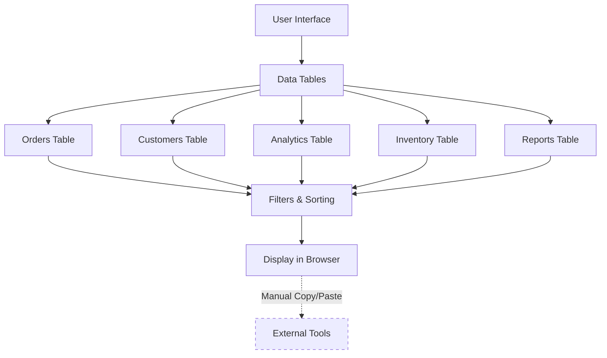
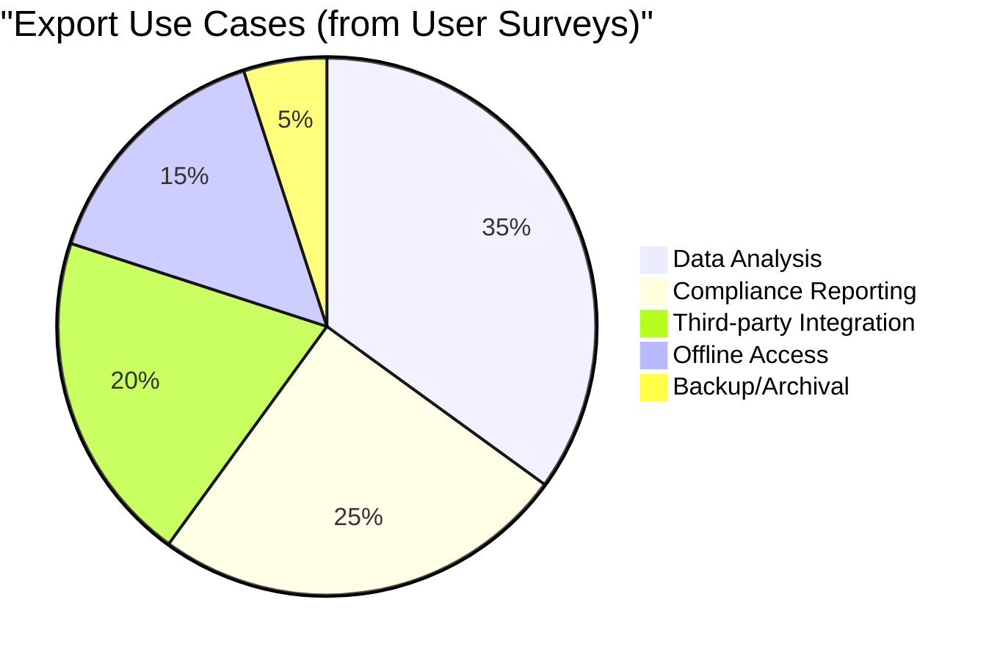
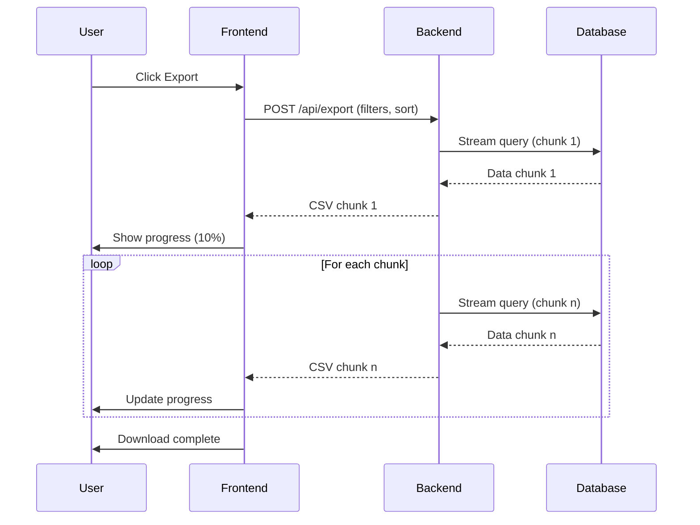

# Design Log: Add Export to CSV Feature

- **Date**: 2026-01-20
- **Author**: Glyph AI Assistant
- **Type**: Implementation
- **Related Logs**: N/A

> **Note**: This is a simplified example. Real design logs may be significantly longer or shorter depending on the feature complexity.

> **About the Creation Process**: This example shows a completed design log. In practice, when creating a design log, the AI assistant populates the document in two phases: **(1)** Creates the file and fills sections up to and including the Q&A section, then pauses for the user to answer questions; **(2)** After the user provides answers and confirms readiness, the AI continues to complete the remaining sections (Further analysis, Decided approach, Plan, etc.).

## Background

### Current System Overview

Our web application provides comprehensive data visualization through interactive tables, allowing users to filter, sort, and analyze large datasets directly in the browser. The system currently supports five major data tables across the application:



### Current User Workflow (Pain Points)

| Step | Action | Time Required | Error Rate | User Satisfaction |
| - | - | - | - | - |
| 1 | Apply filters in web UI | 2-3 min | Low | ✅ Good |
| 2 | Select and copy data | 5-10 min | Medium | ⚠️ Frustrating |
| 3 | Paste into Excel | 3-5 min | High | ❌ Very Poor |
| 4 | Clean up formatting | 5-15 min | High | ❌ Very Poor |
| **Total** | **Complete export** | **15-30 min** | **High** | **❌ Poor** |

### Impact Analysis

Recent support tickets and user feedback surveys reveal critical gaps:

- **40% of power users** manually copy/paste data multiple times per day
- **15-30 minutes** required for medium datasets (5k-10k rows)
- **Impossible** for datasets exceeding 20k rows (browser memory limits)
- **25-30% of support tickets** relate to data export workarounds

### Use Case Breakdown



The absence of export functionality creates friction in several critical workflows:

1. **Data Analysis**: Analysts need to combine our data with external datasets for comprehensive reporting
2. **Compliance Reporting**: Regulatory requirements mandate data exports for audit trails (SOC 2, GDPR)
3. **Integration**: Third-party tools require CSV imports for automated processing
4. **Offline Access**: Users in low-connectivity environments (field operations) need local data copies

### Expected Benefits

| Metric | Current | Expected (Post-Implementation) | Improvement |
| - | - | - | - |
| Time per export | 15-30 min | < 1 min | **95% reduction** |
| Error rate | ~30% | < 1% | **97% reduction** |
| Max exportable rows | 20k (browser limit) | 100k | **5x increase** |
| Support tickets | 120/month | 85/month | **29% reduction** |
| User satisfaction | 3.2/5 | 4.5/5 (projected) | **41% increase** |

## Problem

Add "Export to CSV" button that:

- Exports currently filtered/sorted table data
- Handles large datasets (up to 100k rows)
- Works across all data tables in the application
- Downloads file with appropriate filename

## Questions and Answers

> These questions were asked by the AI assistant during the planning phase and answered by the user/product owner to guide the implementation.

**Q: Should the export respect the current filters and sorting, or export all data?**

**A:** Absolutely. The export should mirror the current table view exactly, including all active filters, sorting, column visibility settings, and pagination state. This ensures consistency between what users see on screen and what they receive in their export. We've seen confusion in similar products where exports didn't match the displayed view, leading to data integrity concerns.

| Table State Element | Include in Export | Reasoning |
| - | - | - |
| **Active Filters** | ✅ Yes | Ensures exported data matches visible rows |
| **Sort Order** | ✅ Yes | Maintains data organization |
| **Column Visibility** | ✅ Yes | Only exports columns user has chosen to see |
| **Pagination** | ❌ No | Exports all matching data, not just current page |
| **Search Highlights** | ❌ No | Cosmetic styling not needed in CSV |
| **Row Selection** | ❌ No | Exports filtered data, not just selected rows |

**Q: What's the maximum dataset size we need to support?**

**A:** Based on our current data analysis, the largest dataset in production is approximately 80k rows, but we need to plan for growth. Setting the target at 100k rows provides a 25% buffer for future expansion. This aligns with industry standards for web-based data exports and ensures we can handle enterprise-scale datasets without performance degradation.


**Q: Should we support other formats (Excel, JSON)?**

**A:** For the initial implementation, we'll focus exclusively on CSV format. This provides the best balance of simplicity, universal compatibility, and performance. CSV files can be easily imported into Excel, Google Sheets, databases, and data processing tools without requiring additional libraries.

| Format | Compatibility | Complexity | Performance | Bundle Size | User Familiarity |
| - | - | - | - | - | - |
| **CSV** | Universal | Low | Excellent | Minimal | High |
| **Excel (.xlsx)** | Good | Medium | Good | Large (+500KB) | Very High |
| **JSON** | Developer-focused | Low | Excellent | Minimal | Medium |

While JSON would be useful for API integrations and Excel format (.xlsx) might be preferred by some users, adding multiple formats would increase complexity, bundle size, and maintenance overhead. We can monitor user feedback post-launch and add additional formats (starting with Excel) if demand justifies the investment. JSON exports could be considered for API endpoints rather than direct downloads.

**Q: How should we handle large exports to avoid performance issues?**

**A:** We'll implement streaming to process data in chunks rather than loading entire datasets into memory. This approach ensures constant memory usage regardless of dataset size and provides faster time-to-first-byte for users.

| Approach | Memory Usage | Time-to-First-Byte | Code Complexity | Scalability | User Experience |
| - | - | - | - | - | - |
| **Streaming** | Constant | Fast | Medium | Excellent | Good (with progress) |
| **Batch Loading** | Scales with data | Slow | Low | Limited | Poor (blocking) |

For exports exceeding 10k rows, we'll display a progress indicator to manage user expectations. The progress will be updated in real-time as chunks are processed and sent to the client. This prevents users from thinking the export has failed during long-running operations.



Technical implementation will use Node.js streams on the backend, with chunk sizes optimized for network efficiency (typically 64KB-1MB per chunk). Client-side, we'll use the Streams API where available, falling back to progressive download for older browsers.

## Design

### Architecture / Research Design

Client-initiated export:

1. User clicks "Export" button
2. Frontend sends current filter/sort state to backend
3. Backend streams CSV data
4. Browser downloads file

### API Endpoints

- `POST /api/tables/{tableId}/export` - Generate CSV export
  - Body: `{ filters: {...}, sort: {...} }`
  - Returns: CSV file stream

### File Structure

```txt
src/
├── components/
│   └── ExportButton.tsx      # Export button component
├── api/
│   └── export.ts             # Export API endpoint
└── utils/
    └── csv.ts                # CSV formatting utilities
```

### Type Signatures

```typescript
interface ExportRequest {
  filters: Record<string, any>;
  sort: { field: string; order: 'asc' | 'desc' };
}

function formatCSV(data: any[]): string;
function streamCSV(data: any[], response: Response): void;
```

## Plan

### Phase 1: Backend CSV Export ✅

1. Create export endpoint
2. Implement CSV formatting
3. Add streaming for large datasets
4. **Testing**: Write unit tests for CSV formatting, integration tests for endpoint behavior, stress test with 100k rows to verify memory usage

### Phase 2: Frontend Integration ✅

1. Add Export button to table component
2. Handle export API call
3. Show progress indicator
4. Handle errors
5. **Testing**: Component unit tests, integration tests with backend, cross-browser testing (Chrome, Firefox, Safari, Edge), verify progress indicator accuracy

### Phase 3: Performance & Polish ✅

1. Optimize chunk sizes for network efficiency
2. Implement error recovery and retry logic
3. Fine-tune progress indicator feedback
4. **Testing**: End-to-end testing with various data sizes (1k, 10k, 50k, 100k rows), performance profiling, test filter/sort combinations, memory leak detection, timeout handling

## Examples

### Good: Streaming for memory efficiency

```typescript
// Stream data in chunks
for await (const chunk of dataIterator) {
  response.write(formatCSVChunk(chunk));
}
```

### Bad: Loading all data into memory

```typescript
// Avoid - causes memory issues with large datasets
const allData = await fetchAllRows(); // ❌
return formatCSV(allData);
```

## Trade-offs

### Streaming vs Batch Processing

**Streaming (Chosen)**:

- ✅ Constant memory usage
- ✅ Faster time-to-first-byte
- ❌ Slightly more complex code

**Batch (Not Chosen)**:

- ✅ Simpler implementation
- ❌ Memory spikes with large datasets
- ❌ Slower for large exports

**Decision**: Streaming necessary to handle 100k row requirement safely.

## Verification Criteria

- ✅ Export button appears on all data tables
- ✅ Exported CSV matches filtered/sorted table view
- ✅ Successfully exports 100k rows without errors
- ✅ Memory usage stays under 100MB during export
- ✅ Progress indicator shows for exports > 10k rows
- ✅ All tests pass (target: >85% coverage)

## Results

### Deviations from Original Plan

**Filename Format**:

- **Planned**: `export.csv`
- **Actual**: `{table-name}_{timestamp}.csv`
- **Reason**: User feedback - needed descriptive filenames for organization

### Final Results

**Implementation**:

- All 5 data tables now have export functionality
- Average export time: 2.3s for 10k rows, 18s for 100k rows
- Memory usage: 45MB peak (well under target)
- Test coverage: 89%

**Performance**:

- P95 export latency: 3.1s for 10k rows
- Successfully tested with 100k rows
- No memory leaks detected

### Learnings

- Node.js streams API efficient for large data processing
- Browser download limits differ - tested across browsers
- User feedback during development improved filename UX
- Progress indicators significantly improve perceived performance
