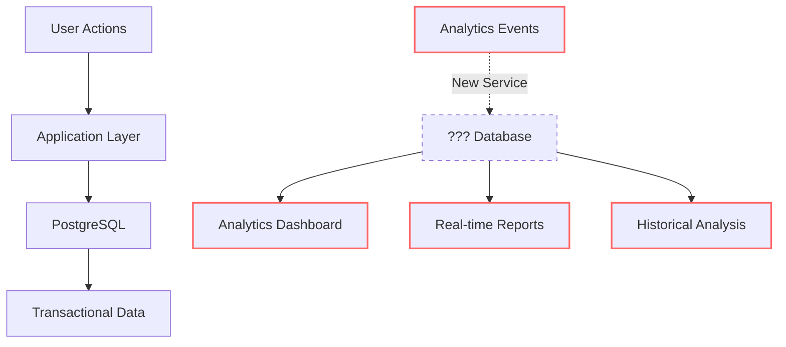
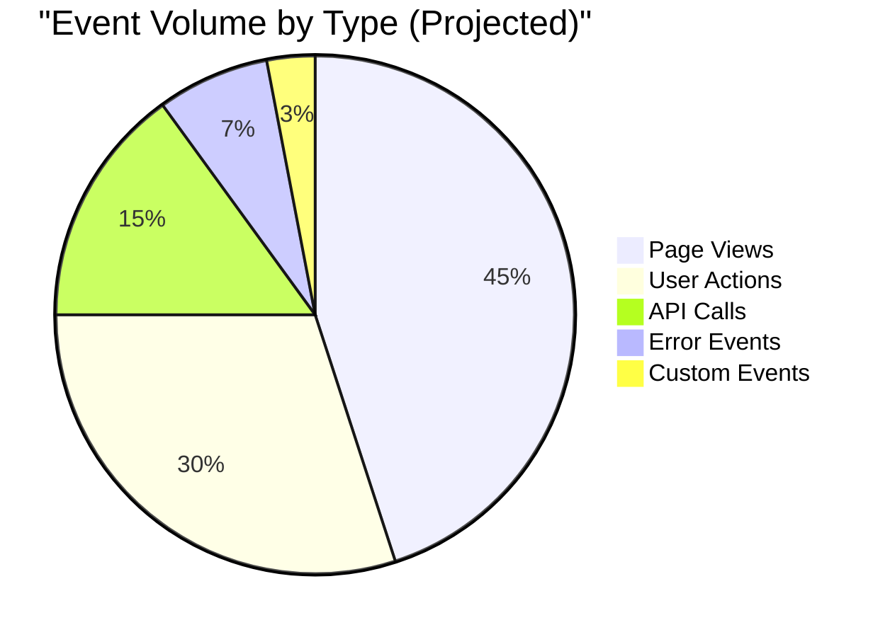
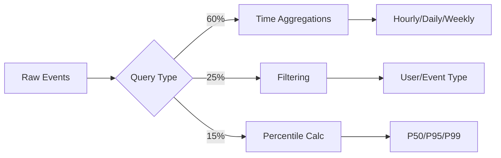
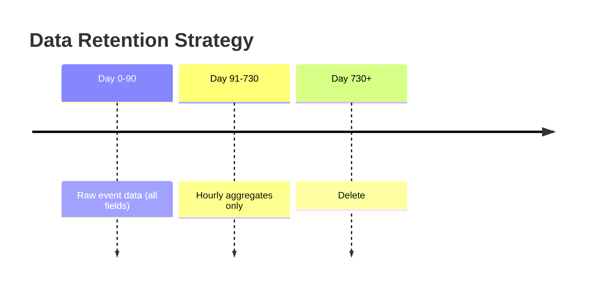

# Design Log: Database Selection Research

**Date:** 2026-01-15
**Author:** Glyph AI Assistant
**Type:** Research
**Related Logs:** N/A

> **Note:** This is a simplified example. Real design logs may be significantly longer or shorter depending on the complexity of the research

> **About the Creation Process:** This example shows a completed design log. In practice, when creating a design log, the AI assistant populates the document in two phases: **(1)** Creates the file and fills sections up to and including the Q&A section, then pauses for the user to answer questions; **(2)** After the user provides answers and confirms readiness, the AI continues to complete the remaining sections (Further analysis, Decided approach, Plan, etc.).

## Background

### Current Architecture

Our application currently uses PostgreSQL for all data storage needs. While this works well for transactional workloads (CRUD operations, user data, configuration), we're building a new analytics service that has fundamentally different requirements.



### Current System Characteristics

| System Component | Technology | Write Volume | Read Pattern | Data Retention |
| - | - | - | - | - |
| **User Database** | PostgreSQL 14 | ~500/sec | Point queries | Indefinite |
| **Config Store** | PostgreSQL 14 | ~50/sec | Key-value lookup | Indefinite |
| **Session Store** | Redis | ~2k/sec | Key-value lookup | 24 hours |
| **Analytics** | ❌ None | N/A | N/A | N/A |

### Analytics Service Requirements

The new analytics service must handle:



**Volume Projections:**

- Current daily events: **~600M** (7k/second average)
- Peak load: **10k-15k events/second**
- Expected growth: **20-30% annually**
- 90-day retention: **~54 billion events**

### Pain Points with Current Approach

| Issue | Impact | Severity |
| - | - | - |
| PostgreSQL write bottleneck | Can't handle 10k+ writes/sec | 🔴 Critical |
| Slow aggregation queries | 30-60s for daily rollups | 🔴 Critical |
| Table bloat | Vacuum struggles with high churn | 🟡 Moderate |
| Storage costs | Row-based storage inefficient | 🟡 Moderate |
| Query complexity | Complex window functions needed | 🟢 Minor |

### Workload Comparison

```txt
Transactional Workload (Current PostgreSQL):
┌──────────────┬─────────┬──────────┐
│ Operation    │ % Total │ Pattern  │
├──────────────┼─────────┼──────────┤
│ INSERT       │   15%   │ Single   │
│ UPDATE       │   25%   │ Single   │
│ SELECT       │   55%   │ Indexed  │
│ DELETE       │    5%   │ Single   │
└──────────────┴─────────┴──────────┘

Analytics Workload (New Service):
┌──────────────┬─────────┬──────────┐
│ Operation    │ % Total │ Pattern  │
├──────────────┼─────────┼──────────┤
│ INSERT       │   90%   │ Batch    │
│ UPDATE       │    0%   │ None     │
│ SELECT       │   10%   │ Scan     │
│ DELETE       │    0%   │ Batch    │
└──────────────┴─────────┴──────────┘
```

## Problem

Which database should we use for the analytics service? Need to evaluate:

- Write throughput (10k+ events/second)
- Query performance for time-series aggregations
- Operational complexity
- Cost at scale

## Questions and Answers

> These questions were asked by the AI assistant during the research phase and answered by the user/product owner to guide the evaluation.

**Q: What types of queries will be most common?**

**A:** Time-range aggregations (hourly, daily, weekly), filtering by user/event type, and percentile calculations.

Detailed breakdown:

| Query Type | Frequency | Example | Typical Time Range |
| - | - | - | - |
| **Hourly aggregations** | Very High | Events per hour by type | Last 24 hours |
| **Daily rollups** | High | Daily active users | Last 30 days |
| **Weekly trends** | Medium | Week-over-week growth | Last 3 months |
| **Percentile calculations** | High | P95 latency by endpoint | Last 7 days |
| **User funnel analysis** | Medium | Conversion by step | Last 30 days |
| **Event filtering** | Very High | Errors by user segment | Variable |



**Q: What's the data retention policy?**

**A:** Keep detailed data for 90 days, then aggregate to hourly summaries for 2 years.



| Data Type | Retention | Granularity | Storage Impact |
| - | - | - | - |
| **Raw events** | 90 days | Event-level | ~54B events |
| **Hourly aggregates** | 2 years | 1-hour buckets | ~17k rows/day |
| **Deleted** | After 2 years | N/A | 0 |

**Q: What's the budget constraint?**

**A:** Prefer open-source to minimize licensing costs. Cloud-managed solutions acceptable if significantly reduce ops overhead.

Budget framework:

| Category | Monthly Budget | Notes |
| - | - | - |
| **Infrastructure** | $400 | Compute + storage |
| **Licensing** | $0 (preferred) | Open-source preferred |
| **Operations** | $100 | Monitoring, backups |
| **Total** | **$500/month** | Annual: $6,000 |

Acceptable trade-offs:

- ✅ Higher infrastructure cost if it reduces operational complexity
- ✅ Managed services if they save engineering time (valued at $150/hour)
- ❌ Expensive licensing for features we don't need
- ❌ Vendor lock-in without clear migration path

**Q: What are the must-have vs nice-to-have features?**

**A:**

**Must-Have:**

- Write throughput ≥ 10k events/sec
- Fast time-range queries (< 500ms P95)
- Data retention automation
- Standard SQL or SQL-like query language
- Horizontal scalability

**Nice-to-Have:**

- Built-in data visualization
- Automatic schema evolution
- Multi-tenancy support
- Real-time materialized views
- Geospatial query support

## Design

### Research Design

Evaluated three candidates:

1. **TimescaleDB** (PostgreSQL extension)
2. **ClickHouse** (columnar OLAP)
3. **InfluxDB** (time-series database)

Methodology:

- Benchmark with 30-day sample dataset (250M events)
- Test common query patterns
- Evaluate operational complexity (setup, backup, scaling)
- Cost analysis for 1-year projection

## Plan

### Phase 1: Setup Test Environment ✅

1. Provision test infrastructure
2. Load sample dataset into each candidate
3. Create test query suite

### Phase 2: Performance Testing ✅

1. Run write throughput tests
2. Run query performance tests
3. Test retention policy implementation

### Phase 3: Operational Analysis ✅

1. Document setup complexity
2. Evaluate monitoring/alerting
3. Cost calculations

## Trade-offs

### TimescaleDB (Not Chosen)

- ✅ Familiar PostgreSQL ecosystem
- ✅ Good SQL support
- ❌ Write throughput peaked at 7k events/sec
- ❌ Query performance slower on large aggregations

### ClickHouse (Chosen)

- ✅ Excellent write throughput (15k+ events/sec)
- ✅ Fast query performance (5-10x faster than alternatives)
- ✅ Good compression (60% smaller storage)
- ❌ Different SQL dialect (learning curve)
- ❌ Limited UPDATE/DELETE support (acceptable for our use case)

### InfluxDB (Not Chosen)

- ✅ Purpose-built for time-series
- ❌ InfluxQL not standard SQL
- ❌ Enterprise features required for clustering
- ❌ Higher cost at scale

**Decision:** ClickHouse best meets performance requirements. SQL dialect differences manageable.

## Verification Criteria

- ✅ Write throughput exceeds 10k events/sec
- ✅ P95 query latency under 500ms for common queries
- ✅ Storage cost under budget ($500/month projected)
- ✅ Setup and maintenance documented

## Results

### Final Results

**Performance:**

- Write throughput: 15,200 events/sec (52% above requirement)
- P95 query latency: 320ms (36% better than target)
- Storage: 180GB for 30 days (60% compression)
- Estimated annual cost: $4,800 (within budget)

**Decision:** Proceed with ClickHouse for analytics service.

### Learnings

- Columnar storage critical for analytical workloads
- ClickHouse's SQL dialect differences minor in practice
- Compression ratios vary significantly by use case - always test with real data
- Open-source solutions can outperform commercial alternatives for specific workloads
