Advanced Flowchart with Various Node Shapes

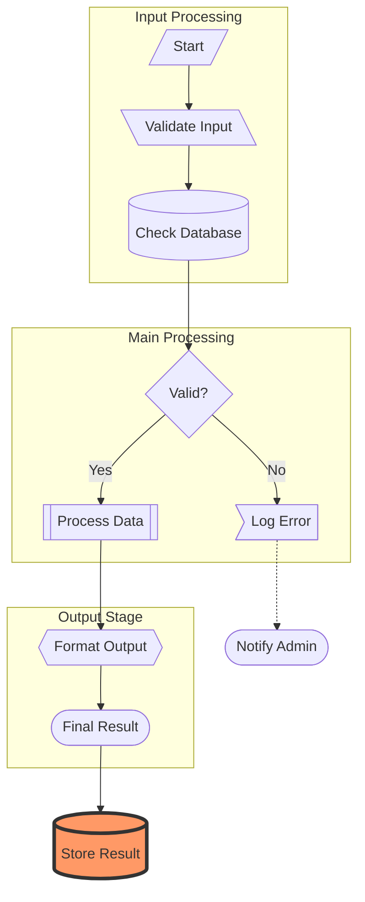
```mermaid
flowchart TB
    %% Styling
    classDef critical fill:#f96,stroke:#333,stroke-width:4px;
    classDef cloud fill:#00f2fe,stroke:#0d47a1;

    subgraph Input_Processing [Input Processing]
        direction LR
        Start[/Start/] --> Validate[\Validate Input\]
        Validate --> DB_Check[(Check Database)]
    end

    subgraph Main_Logic [Main Processing]
        direction TB
        DB_Check --> Decision{Valid?}
        Decision -- Yes --> Process[[Process Data]]
        Decision -- No --> Error>Log Error]
    end

    subgraph Output_Stage [Output Stage]
        Process --> Format{{Format Output}}
        Format --> Final([Final Result])
    end

    Error -.-> Notify([Notify Admin])
    Final --> Storage[(Store Result)]:::critical
```

Complex Sequence Diagram

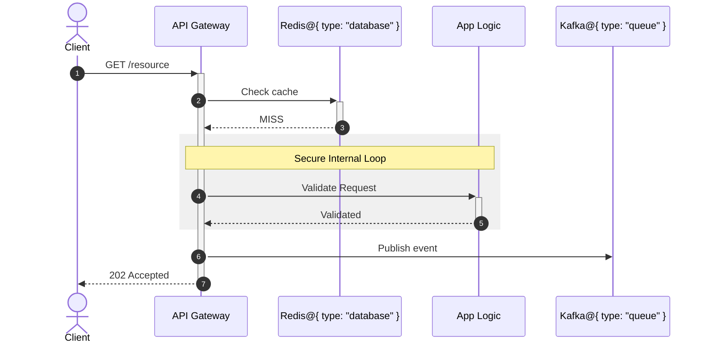
```mermaid
sequenceDiagram
    autonumber
    actor User as Client
    participant API as API Gateway
    participant Cache as Redis@{ type: "database" }
    participant Service as App Logic
    participant Queue as Kafka@{ type: "queue" }

    User->>+API: GET /resource
    API->>+Cache: Check cache
    Cache-->>-API: MISS
    
    rect rgb(240, 240, 240)
        Note over API, Service: Secure Internal Loop
        API->>+Service: Validate Request
        Service-->>-API: Validated
    end

    API->>Queue: Publish event
    API-->>-User: 202 Accepted
```

ZenUML (Code-to-Diagram)

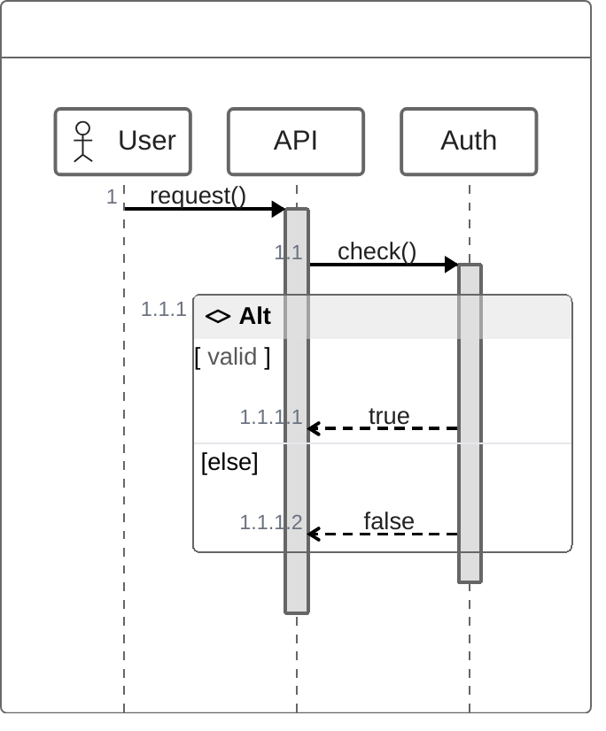
```mermaid
zenuml
    @Actor User
    @Starter(User)
    API.request() {
        Auth.check() {
            if(valid) {
                return true
            } else {
                return false
            }
        }
    }
```

Nested State Diagram (v2)

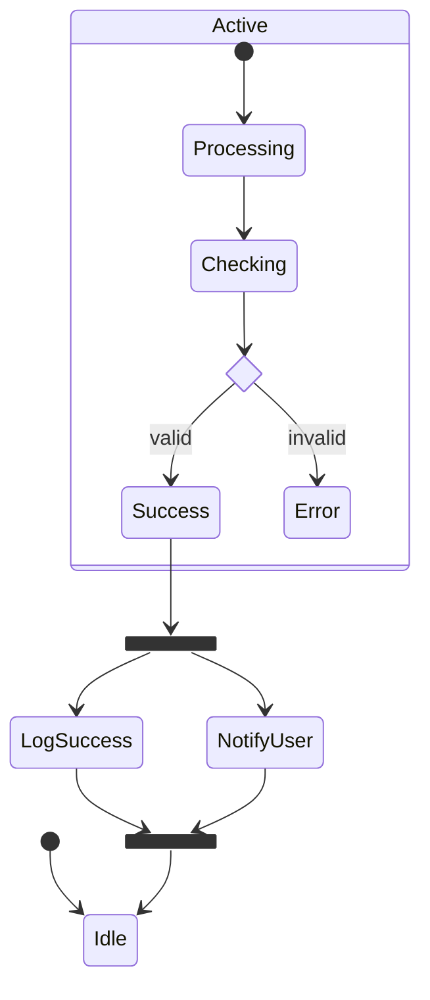
```mermaid
stateDiagram-v2
    [*] --> Idle
    
    state Active {
        [*] --> Processing
        Processing --> Checking
        
        state if_valid <<choice>>
        Checking --> if_valid
        if_valid --> Success : valid
        if_valid --> Error : invalid
    }

    state fork_state <<fork>>
    Success --> fork_state
    fork_state --> LogSuccess
    fork_state --> NotifyUser

    state join_state <<join>>
    LogSuccess --> join_state
    NotifyUser --> join_state
    join_state --> Idle
```

Comprehensive Entity Relationship Diagram (ERD)

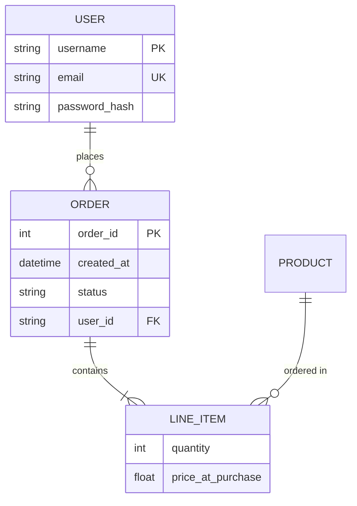
```mermaid
erDiagram
    USER ||--o{ ORDER : "places"
    ORDER ||--|{ LINE_ITEM : "contains"
    PRODUCT ||--o{ LINE_ITEM : "ordered in"

    USER {
        string username PK
        string email UK
        string password_hash
    }
    ORDER {
        int order_id PK
        datetime created_at
        string status
        string user_id FK
    }
    LINE_ITEM {
        int quantity
        float price_at_purchase
    }
```

Advanced Class Diagram

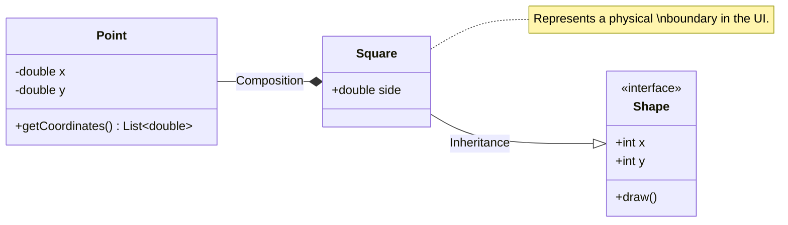
```mermaid
classDiagram
    direction RL
    class Shape {
        <<interface>>
        +int x
        +int y
        +draw()
    }
    class Point {
        -double x
        -double y
        +getCoordinates() List~double~
    }
    class Square {
        +double side
    }
    
    Shape <|-- Square : Inheritance
    Square *-- Point : Composition
    
    note for Square "Represents a physical \nboundary in the UI."
```

Requirement Diagram

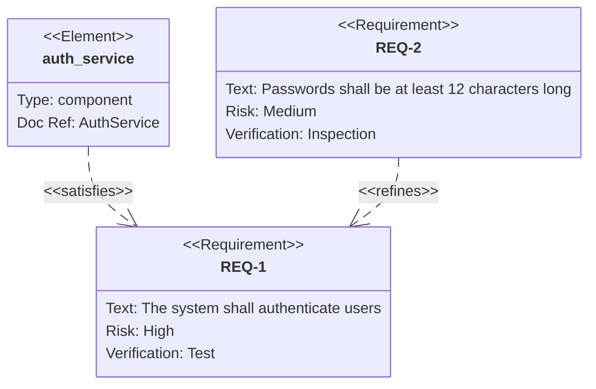
```mermaid
requirementDiagram

requirement "REQ-1" {
  text: "The system shall authenticate users"
  risk: high
  verifymethod: test
}

requirement "REQ-2" {
  text: "Passwords shall be at least 12 characters long"
  risk: medium
  verifymethod: inspection
}

element auth_service {
  type: component
  docref: "AuthService"
}

auth_service - satisfies -> "REQ-1"
"REQ-2" - refines -> "REQ-1"
```

Architecture Diagram (Cloud)

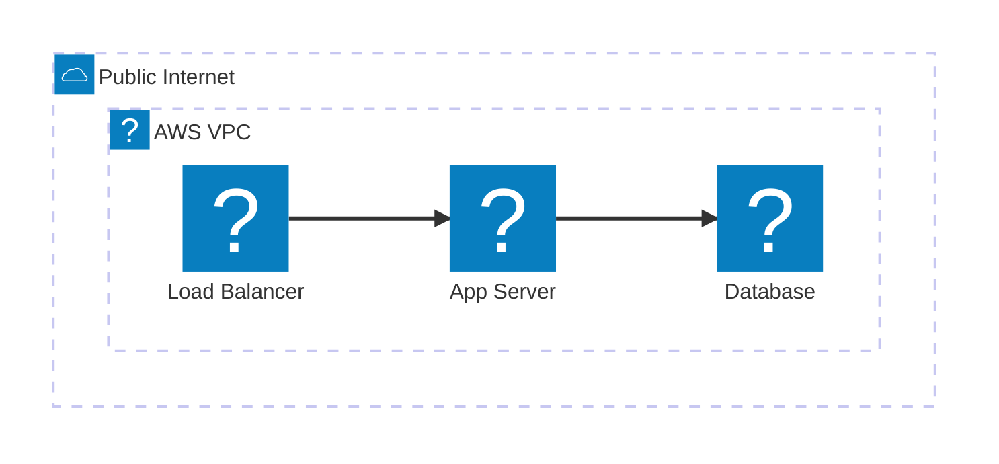
```mermaid
architecture-beta
    group public(cloud)[Public Internet]
    group vpc(logos:aws-vpc)[AWS VPC] in public

    service lb(logos:aws-elb)[Load Balancer] in vpc
    service app(logos:aws-ec2)[App Server] in vpc
    service db(logos:aws-rds)[Database] in vpc

    lb:R --> L:app
    app:R --> L:db
```

C4 Context Diagram

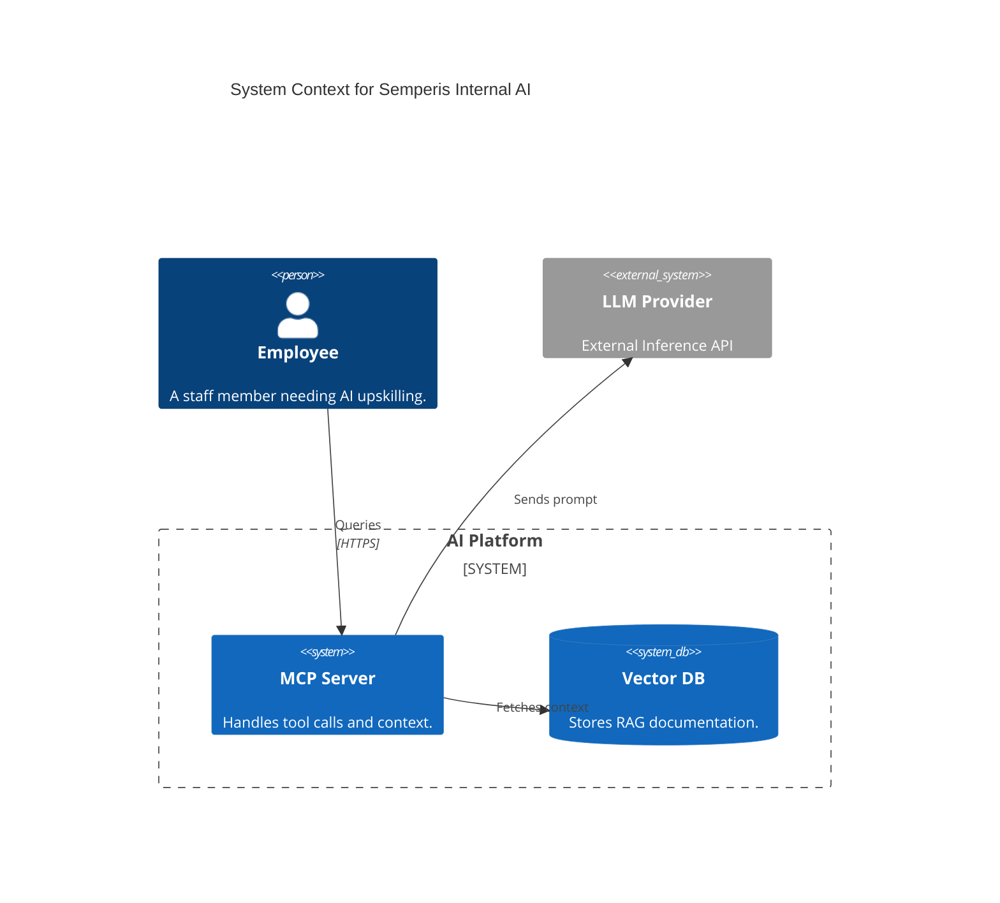
```mermaid
C4Context
    title System Context for Semperis Internal AI
    Person(user, "Employee", "A staff member needing AI upskilling.")
    System_Boundary(b1, "AI Platform") {
        System(mcp, "MCP Server", "Handles tool calls and context.")
        SystemDb(vector, "Vector DB", "Stores RAG documentation.")
    }
    System_Ext(openai, "LLM Provider", "External Inference API")

    Rel(user, mcp, "Queries", "HTTPS")
    Rel(mcp, vector, "Fetches context")
    Rel(mcp, openai, "Sends prompt")
```

Block Diagram

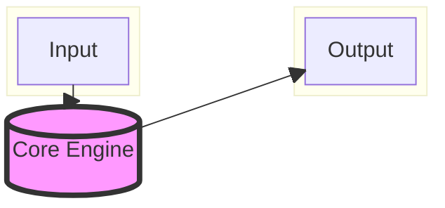
```mermaid
block-beta
    columns 3
    block:left:1
        A["Input"]
    end
    space:1
    block:right:1
        B["Output"]
    end
    A --> Logic[("Core Engine")]
    Logic --> B
    
    style Logic fill:#f9f,stroke:#333,stroke-width:4px
```

Detailed Gantt Chart

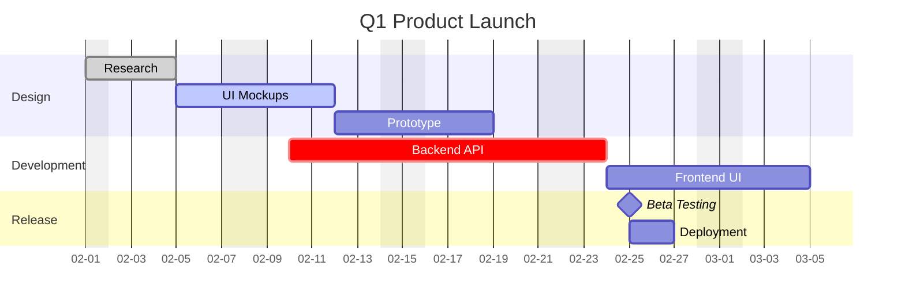
```mermaid
gantt
    title Q1 Product Launch
    dateFormat  YYYY-MM-DD
    axisFormat  %m-%d
    excludes    weekends

    section Design
    Research     :done,    des1, 2026-02-01, 2026-02-05
    UI Mockups   :active,  des2, after des1, 5d
    Prototype    :         des3, after des2, 5d

    section Development
    Backend API  :crit,    dev1, 2026-02-10, 10d
    Frontend UI  :         dev2, after dev1, 7d
    
    section Release
    Beta Testing :milestone, m1, 2026-02-25, 0d
    Deployment   :         rel1, after m1, 2d
```

Detailed Timeline

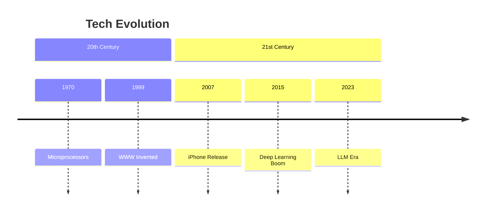
```mermaid
timeline
    title Tech Evolution
    section 20th Century
        1970 : Microprocessors
        1989 : WWW Invented
    section 21st Century
        2007 : iPhone Release
        2015 : Deep Learning Boom
        2023 : LLM Era
```

XY Chart (Combined)

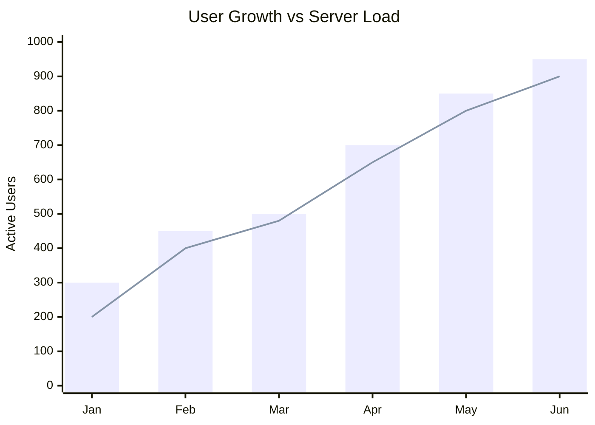
```mermaid
xychart-beta
    title "User Growth vs Server Load"
    x-axis ["Jan", "Feb", "Mar", "Apr", "May", "Jun"]
    y-axis "Active Users" 0 --> 1000
    bar [300, 450, 500, 700, 850, 950]
    line [200, 400, 480, 650, 800, 900]
```

Enhanced Pie Chart

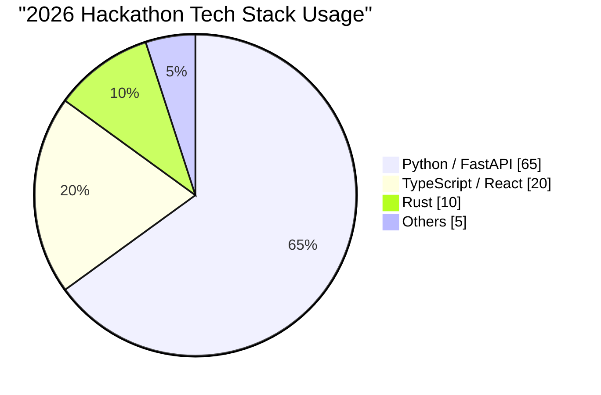
```mermaid
pie showData
    title "2026 Hackathon Tech Stack Usage"
    "Python / FastAPI" : 65
    "TypeScript / React" : 20
    "Rust" : 10
    "Others" : 5
```

Sankey Diagram

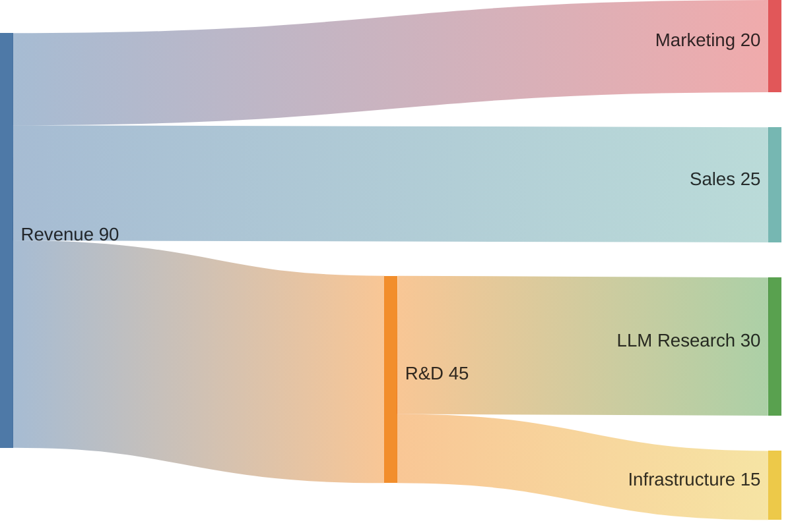
```mermaid
sankey-beta
    Revenue, R&D, 45
    Revenue, Marketing, 20
    Revenue, Sales, 25
    R&D, LLM Research, 30
    R&D, Infrastructure, 15
```

Detailed Quadrant Chart

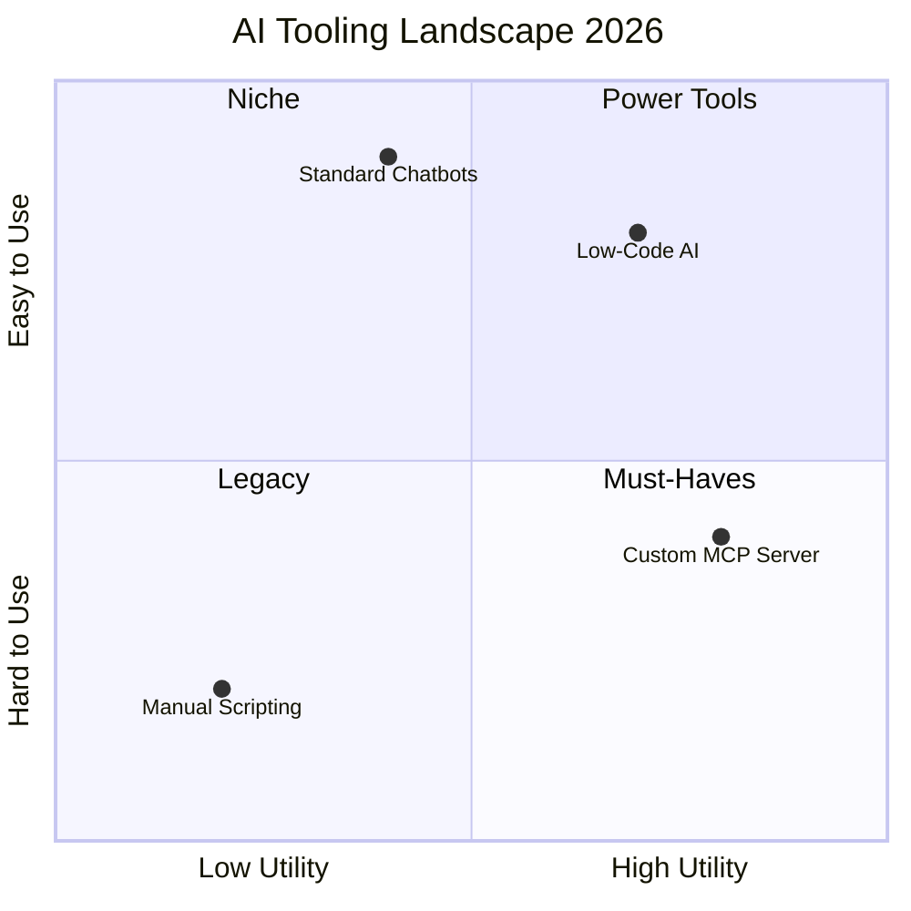
```mermaid
quadrantChart
    title AI Tooling Landscape 2026
    x-axis "Low Utility" --> "High Utility"
    y-axis "Hard to Use" --> "Easy to Use"
    quadrant-1 "Power Tools"
    quadrant-2 "Niche"
    quadrant-3 "Legacy"
    quadrant-4 "Must-Haves"
    "Custom MCP Server": [0.8, 0.4]
    "Standard Chatbots": [0.4, 0.9]
    "Manual Scripting": [0.2, 0.2]
    "Low-Code AI": [0.7, 0.8]
```

Packet Diagram

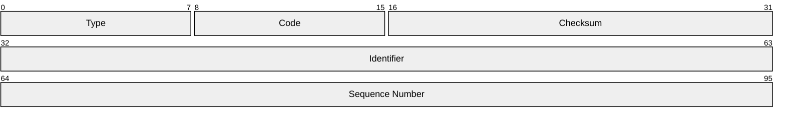
```mermaid
packet-beta
0-7: "Type"
8-15: "Code"
16-31: "Checksum"
32-63: "Identifier"
64-95: "Sequence Number"
```

Kanban Board

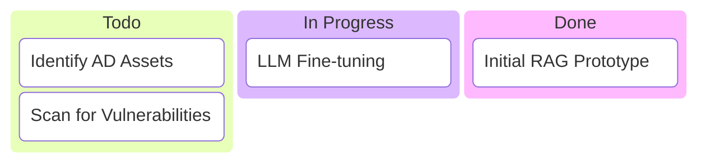
```mermaid
kanban
  Todo
    Identify AD Assets
    Scan for Vulnerabilities
  In Progress
    LLM Fine-tuning
  Done
    Initial RAG Prototype
```

Mindmap with Shapes

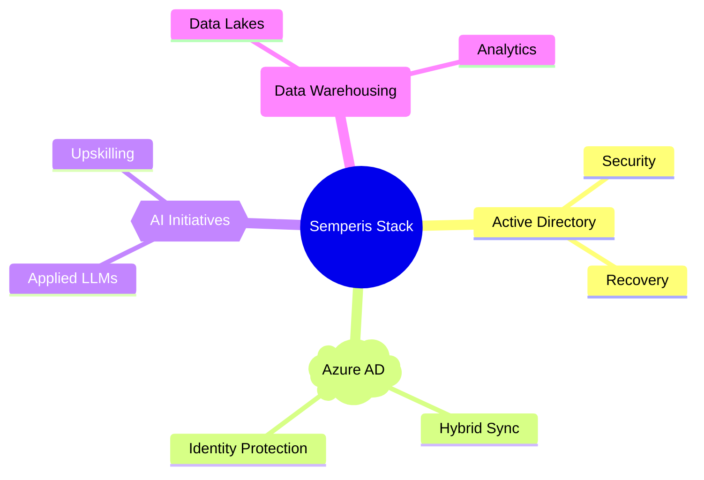
```mermaid
mindmap
  root((Semperis Stack))
    Active Directory
      ::icon(fa fa-shield)
      Security
      Recovery
    )Azure AD(
      Hybrid Sync
      Identity Protection
    {{AI Initiatives}}
      Applied LLMs
      Upskilling
    (Data Warehousing)
      Data Lakes
      Analytics
```

User Journey Map

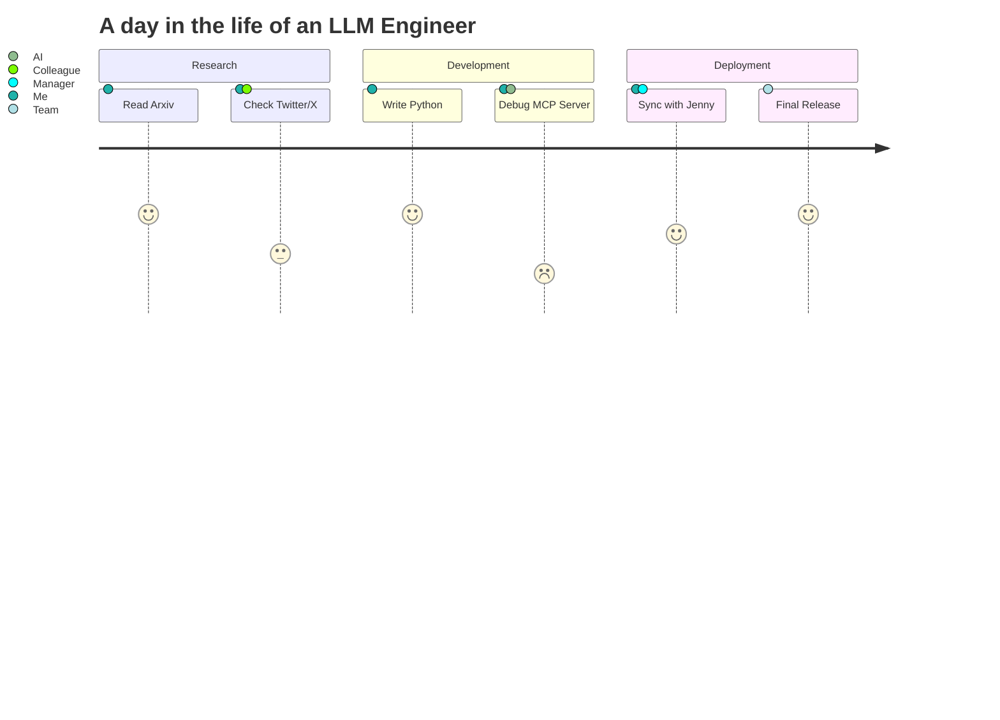
```mermaid
journey
    title A day in the life of an LLM Engineer
    section Research
      Read Arxiv: 5: Me
      Check Twitter/X: 3: Me, Colleague
    section Development
      Write Python: 5: Me
      Debug MCP Server: 2: Me, AI
    section Deployment
      Sync with Jenny: 4: Me, Manager
      Final Release: 5: Team
```

User Journey Map (The Full Version)

```mermaid
journey
    title Employee Onboarding to AI
    section Preparation
      Account Setup: 5: Admin, User
      Initial Training: 3: Trainer
    section Implementation
      First Prompt: 4: User
      Error Handling: 2: User, AI
    section Mastery
      Building Tools: 5: User
```

Styled Git Graph

```mermaid
gitGraph
    commit id: "Initial"
    branch develop
    checkout develop
    commit id: "Feat-A"
    commit id: "Feat-B"
    checkout main
    merge develop tag: "v1.0.0" type: HIGHLIGHT
    branch hotfix
    checkout hotfix
    commit type: REVERSE
    checkout main
    merge hotfix
```
