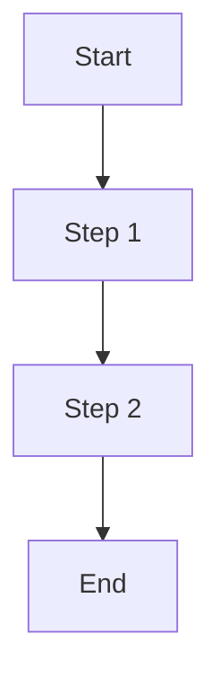
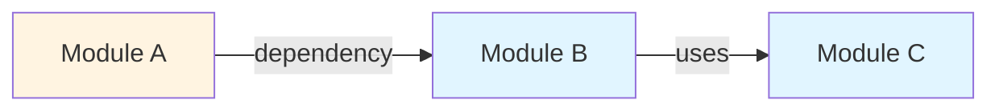
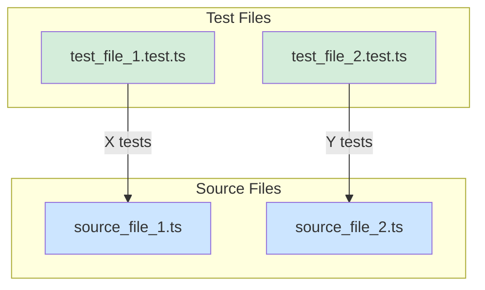
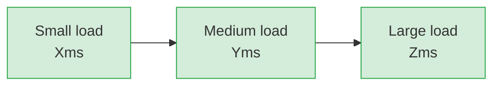

# Code Review Report: [Feature/Module Name]

> **CRITICAL: Issue Consistency Rule**
>
> Everything in this review is EITHER:
>
> - ✅ Good/Pass - No action needed
> - OR it's a tracked issue: `[issue_X emoji]` where emoji = ❌ Blocking, ⚠️ Important, ℹ️ Optional, 🦋 Cosmetic
>
> **NO standalone warnings, concerns, or recommendations without issue tracking.**
>
> Every issue MUST appear in: (1) First mention in detailed sections, (2) Bottom Line table, (3) Summary Table Status column, (4) Executive Summary count, (5) Recommendations section.

## Basic Data

- **Date:** [YYYY-MM-DD]
- **Reviewer:** [Name/Glyph AI Assistant]
- **What is being reviewed:** [Type: Source code / Implementation / Refactoring / etc.]
- **Design Log:** [Link to design log if applicable]
- **Operation Document:** [Link to operation document if applicable]
- **Additional References:** [PR link, commit hash, requirements document, etc.]

---

## Detailed Review

### 1. Functionality Review

#### Requirements Verification

| Requirement | Status | Evidence |
| - | - | - |
| [Requirement 1] | ✅ | [Specific reference to implementation or test] |
| [Requirement 2] | ✅ or [issue_X emoji] | [Specific reference to implementation or test] |
| [Requirement 3] | ✅ or [issue_X emoji] | [Specific reference to implementation or test] |

#### [Optional: Feature Flow Diagram]

#### Edge Cases Handling

- **[Edge Case 1]:** ✅ [Description of how it's handled]
- **[Edge Case 2]:** [issue_X emoji] [Description of issue]
- **[Edge Case 3]:** ✅ [Description of how it's handled]

#### Deviations from Design

1. **[Deviation 1]:** [Description]
   - **Reason:** [Why the deviation was necessary]
   - **Documentation:** [Where is this documented]
   - **Assessment:** ✅ Acceptable / ⚠️ Needs discussion / ❌ Should not have been made

2. **[Deviation 2]:** [Description]
   - **Reason:** [Why the deviation was necessary]
   - **Documentation:** [Where is this documented]
   - **Assessment:** ✅ Acceptable / ⚠️ Needs discussion / ❌ Should not have been made

### 2. Code Quality Review

#### Static Code Analysis

**Reviewed Files/Modules:**

- [File/Module 1]: [X lines, Y methods/functions, Z classes]
- [File/Module 2]: [X lines, Y methods/functions, Z classes]
- [File/Module 3]: [X lines, Y methods/functions, Z classes]

**Abnormal Findings:**

- [Finding 1]: [Description of any unusual metrics or patterns]
- [Finding 2]: [Description of any concerning aspects]

#### SOLID Principles & Design Patterns

- **Single Responsibility:** [Assessment of whether classes/functions have single responsibility]
- **Open/Closed Principle:** [Assessment of extensibility without modification]
- **Liskov Substitution:** [Assessment of interface design if applicable]
- **Interface Segregation:** [Assessment of cohesive interfaces]
- **Dependency Inversion:** [Assessment of abstraction usage]

#### DRY & KISS Principles

- **DRY (Don't Repeat Yourself):** [Assessment of code duplication]
- **KISS (Keep It Simple, Stupid):** [Assessment of complexity and readability]

#### Project Conventions & Patterns

- **Naming conventions:** ✅ or [issue_X emoji] [Assessment]
- **Code structure:** ✅ or [issue_X emoji] [Assessment]
- **Architecture compliance:** ✅ or [issue_X emoji] [Assessment]

#### [Optional: Module Architecture Diagram]

#### Code Readability & Structure

**Positive Observations:**

- [Observation 1]
- [Observation 2]
- [Observation 3]

**Issues (if any):**

- [issue_1 ⚠️] **[Issue Title]** at [Location]
  - **Details:** [Description of the issue]
  - **Recommendation:** [Suggested fix]

- [issue_2 ⚠️] **[Issue Title]** at [Location]
  - **Details:** [Description of the issue]
  - **Recommendation:** [Suggested fix]

#### Inline Comments & Documentation

- **Complex Logic Comments:** ✅ or [issue_X emoji] [Assessment]
- **Function/Method Documentation:** ✅ or [issue_X emoji] [Assessment]
- **Code Clarity:** ✅ or [issue_X emoji] [Assessment]

#### Error Handling

- **Try/Catch Blocks:** ✅ or [issue_X emoji] [Assessment]
- **Error Messages:** ✅ or [issue_X emoji] [Assessment]
- **Error Recovery:** ✅ or [issue_X emoji] [Assessment]
- **Edge Case Errors:** ✅ or [issue_X emoji] [Assessment]

**Issues (if any):**

- [issue_X ⚠️] **[Error Handling Issue]** at [Location]
  - **Details:** [What could fail and how it's handled]
  - **Recommendation:** [Suggested improvement]

#### Logging

- **Log Coverage:** ✅ or [issue_X emoji] [Assessment]
- **Log Levels:** ✅ or [issue_X emoji] [Assessment]
- **Sensitive Data:** ✅ or [issue_X emoji] [Assessment]

---

### 3. Testing Review

#### Unit Tests

| Test File | Tested File(s)/Functionality | Test Count | Coverage Areas |
| - | - | - | - |
| [test_file_1.test.ts] | [source_file_1.ts - features A, B] | [10] | [Unit 1, Unit 2, Edge case 1] |
| [test_file_2.test.ts] | [source_file_2.ts - features C, D] | [15] | [Unit 3, Unit 4, Integration point 1] |

**Total Coverage:** [X%] statements, [Y%] branches, [Z%] functions

#### [Optional: Test Coverage Map]

#### Integration Tests

- **Test 1:** [Description of what is being tested]
  - **Status:** ✅ Present or [issue_X emoji] Missing
  - **Notes:** [Additional context]

- **Test 2:** [Description of what is being tested]
  - **Status:** ✅ Present or [issue_X emoji] Missing
  - **Notes:** [Additional context]

#### Edge Cases & Error Scenarios

**Tested:**

- [Edge case 1]: ✅ Tested at [location]
- [Edge case 2]: ✅ Tested at [location]

**Not Tested:**

- [issue_X emoji] [Edge case 3] - [Description and impact of not testing]
- [issue_Y emoji] [Edge case 4] - [Description and impact of not testing]

#### Test Quality & Best Practices

- **AAA Pattern:** ✅ or [issue_X emoji] [Assessment]
- **Mocks & Stubs:** ✅ or [issue_X emoji] [Assessment]
- **Test Clarity:** ✅ or [issue_X emoji] [Assessment]
- **Test Independence:** ✅ or [issue_X emoji] [Assessment]

**Issues (if any):**

- [issue_X ⚠️] **[Testing Issue]** at [Location]
  - **Details:** [What's concerning about the tests]
  - **Recommendation:** [Suggested improvement]

---

### 4. Documentation Review

#### Code and Documentation Alignment

| Document Type | Document/File | Status | Notes |
| - | - | - | - |
| Design Log | [Link if applicable] | ✅ Aligned or [issue_X emoji] | [Brief note] |
| Operation Doc | [Link if applicable] | ✅ Aligned or [issue_X emoji] | [Brief note] |
| API Docs | [Link if applicable] | ✅ Aligned or [issue_X emoji] | [Brief note] |
| README | [Link if applicable] | ✅ Updated or [issue_X emoji] | [Brief note] |
| Inline Docs | Source files | ✅ Complete or [issue_X emoji] | [Brief note] |

#### Relevant External Documentation

- **[Documentation Type 1]:** [Assessment and findings]
- **[Documentation Type 2]:** [Assessment and findings]
- **[Documentation Type 3]:** [Assessment and findings]

**Issues (if any):**

- [issue_X ⚠️] **[Documentation Issue]** - [Document/Section]
  - **Details:** [What's missing or incorrect]
  - **Recommendation:** [Suggested action]

#### Lessons Learned Documentation

- **In Design Log:** ✅ Documented or [issue_X emoji] [Details]
- **In Operation Document:** ✅ Documented or [issue_X emoji] [Details]
- **Should lessons be propagated to other projects?** ✅ Yes / No - [Reasoning]

---

### 5. Performance & Security Review

#### Performance Analysis

**Measured Performance:**

| Scenario | Metric | Result | Assessment |
| - | - | - | - |
| [Scenario 1] | [Response time/Memory/Throughput] | [Value] | [✅ Good / ⚠️ Acceptable / ❌ Concerning] |
| [Scenario 2] | [Response time/Memory/Throughput] | [Value] | ✅ or [issue_X emoji] |
| [Scenario 3] | [Response time/Memory/Throughput] | [Value] | ✅ or [issue_X emoji] |

#### [Optional: Performance Visualization]

**Performance Assessment:**

- ✅ None identified OR
- [issue_X emoji] [Concern description]

#### Security Review

**Input Validation:**

- ✅ Validated or [issue_X emoji]
- [Details of validation approach]

**Authentication & Authorization:**

- ✅ Secure or [issue_X emoji]
- [Assessment of auth/authz implementation]

**Data Handling:**

- ✅ Secure or [issue_X emoji]
- [Assessment of how sensitive data is handled]

**Security Observations:**

- ✅ [Positive security finding]
- ✅ [Positive security finding]
- [issue_X emoji] [Security concern or recommendation]

### 6. Lessons Learned

#### What Went Well

1. **[Positive finding 1]:** [Detailed explanation of what was done well]

#### What Could Be Improved

1. **[Improvement area 1]:** [What could have been better and why]

#### Unexpected Findings or Insights

- **[Finding 1]:** [Explanation of unexpected discovery]

#### Documentation of Lessons Learned

- **Are lessons documented in design log?** ✅ Yes or [issue_X emoji] [Details]
- **Are lessons documented in operation document?** ✅ Yes or [issue_X emoji] [Details]
- **Should lessons be propagated to other projects?** ✅ Yes / No - [Reasoning]

## Bottom Line - Issues Summary

| Issue # | Category | Location(s) | Origin | Severity | Recommendation |
| - | - | - | - | - | - |
| 1 | [Category] | [File/Method] | [DL or OP reference] | ❌ Blocking / ⚠️ Important / ℹ️ Optional / 🦋 Cosmetic | [Action - 4 words max] |
| 2 | [Category] | [File/Method] | [DL or OP reference] | ❌ Blocking / ⚠️ Important / ℹ️ Optional / 🦋 Cosmetic | [Action - 4 words max] |
| 3 | [Category] | [File/Method] | [DL or OP reference] | ❌ Blocking / ⚠️ Important / ℹ️ Optional / 🦋 Cosmetic | [Action - 4 words max] |

---

## Summary Table

| Aspect | Status | Details |
| - | - | - |
| **Functionality** | ✅ Pass or ⚠️ Warning [issue_X emoji, issue_Y emoji] or ❌ Blocking [issue_X emoji] | [One sentence summary] |
| **Code Quality** | ✅ Pass or ⚠️ Warning [issue_X emoji, issue_Y emoji] or ❌ Blocking [issue_X emoji] | [One sentence summary] |
| **Architecture** | ✅ Pass or ⚠️ Warning [issue_X emoji, issue_Y emoji] or ❌ Blocking [issue_X emoji] | [One sentence summary] |
| **Test Coverage** | ✅ Pass or ⚠️ Warning [issue_X emoji, issue_Y emoji] or ❌ Blocking [issue_X emoji] | [One sentence summary] |
| **Documentation** | ✅ Pass or ⚠️ Warning [issue_X emoji, issue_Y emoji] or ❌ Blocking [issue_X emoji] | [One sentence summary] |
| **Performance** | ✅ Pass or ⚠️ Warning [issue_X emoji, issue_Y emoji] or ❌ Blocking [issue_X emoji] | [One sentence summary, if reviewed] |
| **Security** | ✅ Pass or ⚠️ Warning [issue_X emoji, issue_Y emoji] or ❌ Blocking [issue_X emoji] | [One sentence summary, if reviewed] |

---

## Executive Summary

Overall [good/acceptable/poor] implementation with [X] identified issues.

### ❌ [X] Blocking Issues (Must fix before merge)

- **issue_X:** [One-line description]
- **issue_Y:** [One-line description]

### ⚠️ [Y] Important Issues (Recommended)

- **issue_X:** [One-line description]
- **issue_Y:** [One-line description]
- **issue_Z:** [One-line description]

### ℹ️ [Z] Optional Issues (Nice-to-have)

- **issue_X:** [One-line description]

**Conclusion**: [Summary of what must be done before merge and what should be follow-up work]

---

## Recommendations

### ❌ Blocking

1. [Action for issue_X] (issue_X)
2. [Action for issue_Y] (issue_Y)

### ⚠️ Important

1. [Action for issue_X] (issue_X, [location])
2. [Action for issue_Y] (issue_Y)
3. [Action for issue_Z] (issue_Z)

### ℹ️ Optional

1. [Action for issue_X] (issue_X)

**Note:** [If there are many issues] A more detailed action plan should be created and addressed.

---

## Consistency Checklist

Before finalizing this review, verify:

- [ ] Every issue uses format `[issue_X emoji]` consistently throughout
- [ ] No standalone ⚠️ warnings exist without an issue tag
- [ ] Issue count in Executive Summary matches Bottom Line table row count
- [ ] Every issue in Bottom Line appears in Summary Table (in relevant aspect rows with Status column)
- [ ] Every issue in Bottom Line has a recommendation listed in Recommendations section
- [ ] All "not perfect" items (warnings, concerns, partial implementations) are tracked as issues
