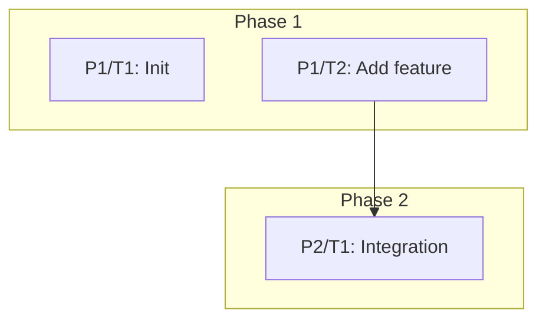

# <Document Title>

## Background

<Provide background information about the operation. The background is encouraged to include mermaid charts where appropriate (glyph's mermaid tool can advise on this).>

## Phases

**Phases overview**:

The phases overview must include two elements:

1) A summary table with these columns: **Phase**, **# Tasks**, **Difficulties**, **Description**. Fill the table with each phase's number, how many tasks it contains, a comma-separated list of each task's difficulty (Breezy|Low|Medium|High|Nightmare), and a short description of the phase goal.

Example table:

| Phase | # Tasks | Difficulties | Description |
| - | - | - | - |
| Phase 1 | 2 | Medium, Low | Implement client-side validation and unit tests |
| Phase 2 | 1 | Low | Update docs and add examples |

2) A DAG showing dependencies at the phase and task level. Use a Mermaid `flowchart` (top-down) and group tasks under phase subgraphs. Label task nodes as `P{phase}/T{task}` (e.g., `P1/T1`). Example:

Include both elements in the `Phases overview` so readers get a concise phase summary and an explicit dependency graph.

### Phase 1: <Phase Title>

<Background information about Phase 1: Describe the issue, current state, and desired outcome.>

**Definition of Done (D.O.D.):**

- [ ] <D.O.D. Item 1>
- [ ] <D.O.D. Item 2>
- [ ] ...

**Phase Difficulty:** <Breezy|Low|Medium|High|Nightmare>

#### P1/Task 1: <Task Title>

<Background information about Task 1.>

**Files Involved:**

- `<File Path 1>`
- `<File Path 2>`
- ...

**P1/Task 1 Subtasks:**

- [ ] <Subtask 1>
- [ ] <Subtask 2>

**Task Difficulty:** <Breezy|Low|Medium|High|Nightmare>

**P1/Task 1 Lessons Learned:**
<Briefly write here what you learned or important considerations. Be concise! If nothing to add, remove this section.>

### Phase 2: <Phase Title>

etc.

## Lessons Learned during Operation

<Write here lessons learned from the entire operation. Be concise!>