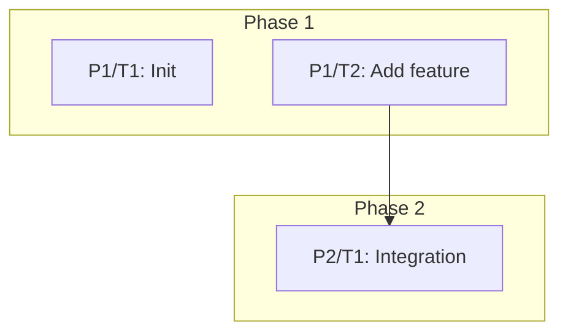

# Operation: [Title]

- **Date:** [YYYY-MM-DD]
- **Author:** Glyph AI Assistant
- **Related Docs:** [Link to related design logs (and specific step, if relevant), operations docs, artifacts (if any)]

## Background

[Sections may be added, removed or modified as needed. The goal is to provide enough context for someone new to the operation to understand why it's needed and what it's about]

### State

[Describe the current state of the system, process, or situation that this operation is addressing. Include any relevant history, context, and why this operation is needed]

### Goal

[Clearly state the goal of this operation. What is the desired outcome?]

### Approach

[Briefly describe the overall approach to achieve the goal. This can be a high-level summary of the phases and tasks that will be undertaken]

## Verification Criteria

[Define what it would take to consider this operation "done". This can include specific deliverables, performance targets, acceptance criteria, or any other measurable outcomes that indicate success]

## Phases

**Phases overview**:

> Tasks difficulty is on the scale of:
>
> - 0️⃣ (Breezy) = No changes required, only verification and documentation.
> - 1️⃣ (Low) = 1-2 files changes, well defined actions, no complex logic.
> - 2️⃣ (Medium) = A few changes to multiple files, some logic to implement, but straightforward.
> - 3️⃣ (High) = Significant changes to multiple files, complex logic, requires coordination.
> - 4️⃣ (Nightmare) = Major changes, high risk, requires extensive testing and validation.
> - 5️⃣ (Hell) = Extremely difficult, high risk, requires significant resources and time.
>
> Status is ❌ (Not started), ⏳ (In progress), ✅ (Done), ⚠️ (Done with issues/aborted)

| Phase # | Status | Title | Difficulty | Tasks |
| - | - | - | - | - |
| P1 | ⚠️ | [Phase 1 Title] | [3️⃣, as the most difficult task in the phase] | <table><tr><th>Task #</th><th>Title</th></th><th>Difficulty</th></th><th>Status</th></tr><tr><td>P1/T1</td><td>[Inner Cell 2]</td><td>3️⃣</td><td>⚠️</td></tr><tr><td>P1/T2</td><td>[Inner Cell 6]</td><td>1️⃣</td><td>✅</td></tr></table> |

**Phases / Tasks DAG**:

### Phase 1: [Phase Title] | ⚠️ | 3️⃣

> 2 Tasks: 3️⃣, 1️⃣

[Background information about Phase 1: Describe the background, current state, context and desired outcome, and anything else relevant to understand the phase]

**Definition of Done (D.O.D.):**

- [ ] [D.O.D. Item 1]
- [ ] [D.O.D. Item 2]
- [ ] ...

#### P1/Task 1: [Task Title] | ⚠️ | 3️⃣

[Background information about Task 1, goal etc. This will only include enough details to understand the task and its context, but not enough to implement it. The implementation are to be determined during planning/implementation, based on the broader context]

**Files Involved:**

- `File\Path_1.py`
- `File\Path_2.cs`
- ...

**P1/Task 1 Subtasks**:

- [ ] [Subtask 1]
  - [ ] [Sublevels allowed only for very complex subtasks. Use discretion and keep it simple]
- [ ] [Subtask 2]

**P1/Task 1 Lessons Learned:**
<Briefly write here what you learned or important considerations. Be concise! If nothing to add, remove this section.>

**Phase 1 Lessons Learned:**
<Write here lessons learned from the entire Phase 1. Be concise! If nothing to add, remove this section.>

#### P1/Task 2: [Task Title] | ✅ | 1️⃣

[etc. etc]

### Phase 2: [Phase Title] | ❌ | 5️⃣

> 3 Tasks: 5️⃣, 4️⃣, 2️⃣

[etc. etc]

## Lessons Learned during Operation

- [Lessons learned in phases/tasks that are relevant to the entire operation]
