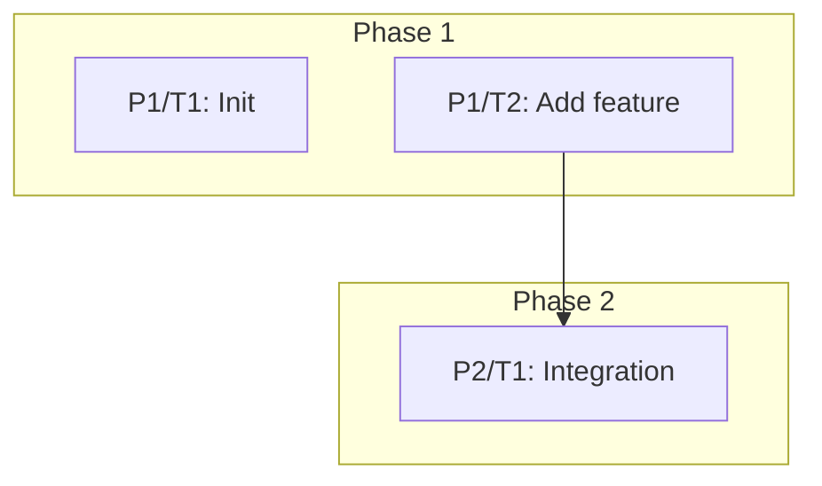

# Operation: [Title]

- **Date:** [YYYY-MM-DD]
- **Author:** Glyph AI Assistant
- **Related Docs:** [Link to related design logs (and specific step, if relevant), operations docs, artifacts (if any)]

## Background

[Sections may be added, removed, or modified as needed. Provide enough context for someone new to understand why this operation is needed.]

### State

[System state, process, or situation being addressed. Include relevant history and context.]

### Goal

[Desired outcome of this operation.]

### Approach

[High-level summary of phases and tasks to achieve the goal.]

## Verification Criteria

[Criteria to consider this operation done: deliverables, performance targets, acceptance criteria, or other measurable outcomes.]

## Phases

**Phases overview**:

> **Phase / task difficulty** is on the scale of 0-5 (0 = trivial, 5 = extremely difficult): 0️⃣, 1️⃣, 2️⃣, 3️⃣, 4️⃣, 5️⃣
>
> **Phase / task status** is one of: ❌ (Not started), ⏳ (In progress), ✅ (Done), ⚠️ (Done with issues/aborted)

| Phase # | Status | Title | Difficulty | Tasks |
| - | - | - | - | - |
| P1 | ⚠️ | [Phase 1 Title] | [3️⃣, as the most difficult task in the phase] | <table><tr><th>Task #</th><th>Title</th></th><th>Difficulty</th></th><th>Status</th></tr><tr><td>P1/T1</td><td>[Inner Cell 2]</td><td>3️⃣</td><td>⚠️</td></tr><tr><td>P1/T2</td><td>[Inner Cell 6]</td><td>1️⃣</td><td>✅</td></tr></table> |

**Phases / Tasks DAG**:

```mermaid
flowchart TD
 subgraph Phase1["Phase 1"]
  P1T1["P1/T1: Init"]
  P1T2["P1/T2: Add feature"]
 end
 subgraph Phase2["Phase 2"]
  P2T1["P2/T1: Integration"]
 end
 P1T2 --> P2T1
```

### Phase 1: [Phase Title] | ⚠️ | 3️⃣

> 2 Tasks: 3️⃣, 1️⃣

[Phase 1 background: current state, context, desired outcome, and relevant details.]

**Definition of Done (D.O.D.):**

- [ ] [D.O.D. Item 1]
- [ ] [D.O.D. Item 2]
- [ ] ...

#### P1/Task 1: [Task Title] | ⚠️ | 3️⃣

[Task 1 background and goal. Include enough to understand the task and context, not enough to implement—implementation details are determined during planning.]

**Files Involved:**

- `File\Path_1.py`
- `File\Path_2.cs`
- ...

**P1/Task 1 Subtasks**:

- [ ] [Subtask 1]
  - [ ] [Sublevels only for very complex subtasks. Keep it simple.]
- [ ] [Subtask 2]

**P1/Task 1 Lessons Learned:**
<Lessons learned or important considerations. Be concise! Remove if nothing to add.>

**Phase 1 Lessons Learned:**
<Lessons learned from Phase 1. Be concise! Remove if nothing to add.>

#### P1/Task 2: [Task Title] | ✅ | 1️⃣

[etc. etc]

### Phase 2: [Phase Title] | ❌ | 5️⃣

> 3 Tasks: 5️⃣, 4️⃣, 2️⃣

[etc. etc]

## Lessons Learned during Operation

- [Lessons learned in phases/tasks that are relevant to the entire operation]
